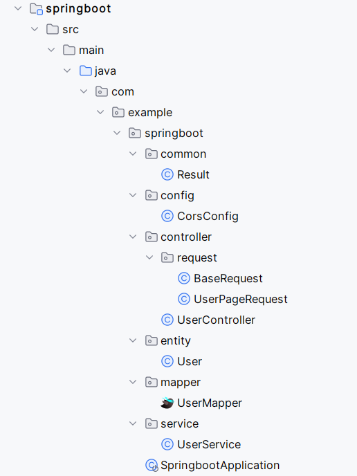
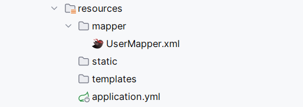
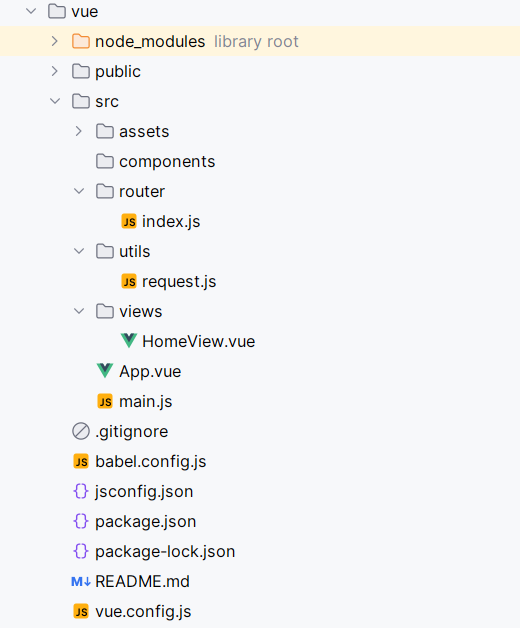
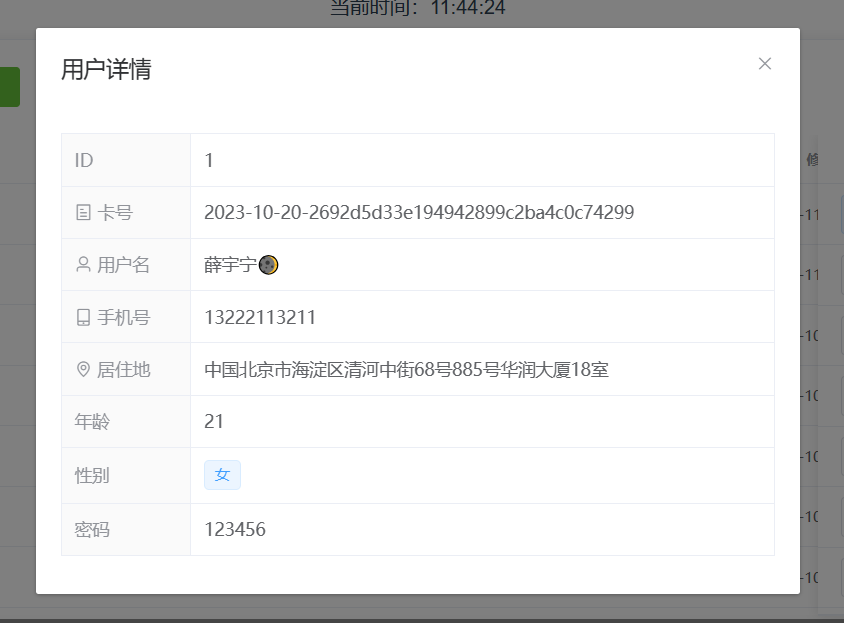
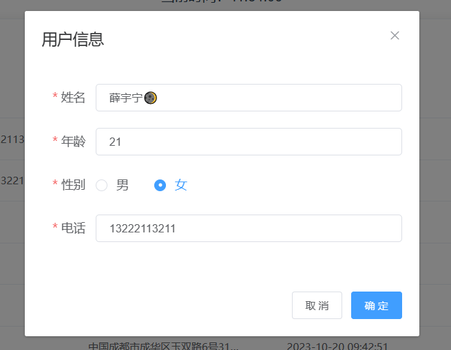
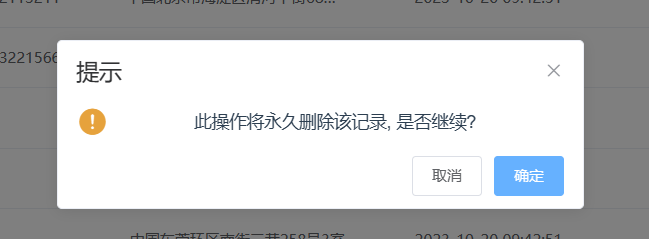
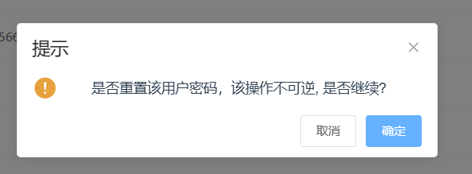
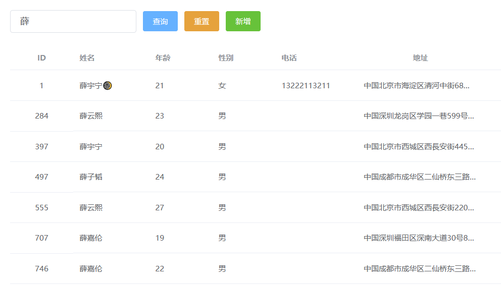
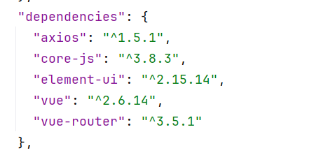

# SpringBoot+Vue实现CRUD


## 1. 项目结构






## 2. 项目实现功能
### 查看用户详情


### 编辑用户信息


### 删除用户信息


### 重置用户密码


### 模糊查询用户信息


## 3. SpringBoot依赖
```xml
<!-- PageHelper-->
<dependency>
    <groupId>com.github.pagehelper</groupId>
    <artifactId>pagehelper-spring-boot-starter</artifactId>
    <version>1.4.6</version>
</dependency>
<!-- TkMyBatis -->
<dependency>
    <groupId>tk.mybatis</groupId>
    <artifactId>mapper</artifactId>
    <version>4.1.5</version>
</dependency>
<!-- Hutool -->
<dependency>
    <groupId>cn.hutool</groupId>
    <artifactId>hutool-all</artifactId>
    <version>5.8.18</version>
</dependency>
```
## 4. SpringBoot 配置文件
```yaml
#配置默认启动端口
server:
  port: 9090

#  数据库配置
spring:
  datasource:
    driver-class-name: com.mysql.cj.jdbc.Driver
    url: jdbc:mysql://localhost:3306/management?useSSL=false&useUnicode=true&characterEncoding=UTF-8&serverTimezone=GMT%2b8
    username: root
    password: 111111


# mybatis相关配置
mybatis:
  #  包所在路径
  mapper-locations: classpath:mapper/*.xml
  type-aliases-package: com.example.springboot.entity
  configuration:
    # 日志
    log-impl: org.apache.ibatis.logging.stdout.StdOutImpl
```

## 5. 数据库表
```sql
CREATE TABLE `user` (
  `id` int(11) NOT NULL AUTO_INCREMENT,
  `name` varchar(255) COLLATE utf8mb4_unicode_ci DEFAULT NULL,
  `username` varchar(255) COLLATE utf8mb4_unicode_ci DEFAULT NULL,
  `age` int(11) DEFAULT NULL,
  `sex` varchar(1) COLLATE utf8mb4_unicode_ci DEFAULT NULL,
  `phone` varchar(255) COLLATE utf8mb4_unicode_ci DEFAULT NULL,
  `address` varchar(255) COLLATE utf8mb4_unicode_ci DEFAULT NULL,
  `createtime` datetime DEFAULT CURRENT_TIMESTAMP,
  `updatetime` datetime DEFAULT NULL,
  `status` tinyint(1) DEFAULT '1',
  `password` varchar(255) COLLATE utf8mb4_unicode_ci DEFAULT NULL,
  PRIMARY KEY (`id`)
) ENGINE=InnoDB AUTO_INCREMENT=1010 DEFAULT CHARSET=utf8mb4 COLLATE=utf8mb4_unicode_ci;
```

## 6. 后端代码实现
### 实体类 User
```java
package com.example.springboot.entity;

import com.fasterxml.jackson.annotation.JsonFormat;
import lombok.Data;

import javax.persistence.GenerationType;
import javax.persistence.*;
import java.util.Date;

@Data
@Table(name = "user")
public class User {
    @Id
    @GeneratedValue(strategy = GenerationType.IDENTITY)
    private Integer id;
    private String name;
    private String username;
    private Integer age;
    private String sex;
    private String phone;
    private String address;

    @JsonFormat(pattern = "yyyy-MM-dd HH:mm:ss", timezone = "GMT+8")
    private Date createtime;
    @JsonFormat(pattern = "yyyy-MM-dd HH:mm:ss", timezone = "GMT+8")
    private Date updatetime;

    private Boolean status;

    private String password;
}

```


### UserMapper
```java
package com.example.springboot.mapper;

import com.example.springboot.controller.request.UserPageRequest;
import com.example.springboot.entity.User;
import org.apache.ibatis.annotations.Select;
import org.springframework.stereotype.Repository;
import tk.mybatis.mapper.common.Mapper;

import java.util.List;

@Repository
public interface UserMapper extends Mapper<User> {

    /**
     * 分页条件查询
     * @param userPageRequest
     * @return
     */
    List<User> page(UserPageRequest userPageRequest);
}
```

### UserMapper.xml
```xml
<?xml version="1.0" encoding="UTF-8" ?>
<!DOCTYPE mapper
        PUBLIC "-//mybatis.org//DTD Mapper 3.0//EN"
        "http://mybatis.org/dtd/mybatis-3-mapper.dtd">
<mapper namespace="com.example.springboot.mapper.UserMapper">


    <select id="page" resultType="com.example.springboot.entity.User">
        select *
        from user
        <where>
            <if test="name != null and name != ''">
                name like concat('%',#{name},'%')
            </if>
        </where>
    </select>
</mapper>

```

### UserService
```java
package com.example.springboot.service;

import cn.hutool.core.date.DateUtil;
import cn.hutool.core.util.IdUtil;
import com.example.springboot.controller.request.UserPageRequest;
import com.example.springboot.entity.User;
import com.example.springboot.mapper.UserMapper;
import com.github.pagehelper.PageHelper;
import com.github.pagehelper.PageInfo;
import org.springframework.stereotype.Service;

import javax.annotation.Resource;
import java.util.Date;
import java.util.List;

@Service
public class UserService {

    private static final String DEFAULT_PASS = "123456";

    @Resource
    UserMapper userMapper;

    /**
     * 分页条件查询
     * @param userPageRequest
     * @return
     */
    public Object page(UserPageRequest userPageRequest) {
        PageHelper.startPage(userPageRequest.getPageNum(), userPageRequest.getPageSize());
        List<User> userList = userMapper.page(userPageRequest);
        return new PageInfo<>(userList);
    }


    /**
     * 新增
     * @param user
     */
    public void insert(User user) {
        Date date = new Date();
        // 当做卡号处理
        user.setUsername(DateUtil.format(date, "yyyy-MM-dd") + "-" + IdUtil.fastSimpleUUID());
        // insertSelective, 忽略空值，只插入非空的值
        userMapper.insertSelective(user);
    }

    /**
     * 修改
     * @param user
     */
    public void update(User user) {
        // 设置默认卡号
        if (user.getUsername() == null) {
            Date date = new Date();
            user.setUsername(DateUtil.format(date, "yyyy-MM-dd") + "-" + IdUtil.fastSimpleUUID());
        }
        user.setUpdatetime(new Date());
        // updateByPrimaryKeySelective, 根据主键修改数据，忽略空值
        userMapper.updateByPrimaryKeySelective(user);
    }

    /**
     * 删除
     * @param id
     */
    public void delete(Integer id) {
        // deleteByPrimaryKey, 根据主键删除
        userMapper.deleteByPrimaryKey(id);
    }

    /**
     * 重置密码
     * @param user
     */
    public void resetPass(User user) {
        user.setUpdatetime(new Date());
        user.setPassword(DEFAULT_PASS);
        userMapper.updateByPrimaryKeySelective(user);
    }
}

```

### UserController
```java
package com.example.springboot.controller;

import com.example.springboot.common.Result;
import com.example.springboot.controller.request.UserPageRequest;
import com.example.springboot.entity.User;
import com.example.springboot.service.UserService;
import org.springframework.web.bind.annotation.*;

import javax.annotation.Resource;
import java.util.List;

@RestController
@RequestMapping("user")
public class UserController {

    @Resource
    UserService userService;

    /**
     * 分页添加查询
     * @param userPageRequest
     * @return
     */
    @GetMapping("page")
    public Result page(UserPageRequest userPageRequest) {
        return Result.success(userService.page(userPageRequest));
    }


    /**
     * 新增、修改
     * @param user
     * @return
     */
    @PostMapping
    public Result save(@RequestBody User user) {
        if (user.getId() == null) {
            userService.insert(user);
        } else {
            userService.update(user);
        }
        return Result.success();
    }


    /**
     * 删除
     * @param id
     * @return
     */
    @DeleteMapping("/{id}")
    public Result delete(@PathVariable Integer id) {
        userService.delete(id);
        return Result.success();
    }
    
    /**
     * 重置密码
     * @param user
     * @return
     */
    @PutMapping("resetPass")
    public Result resetPass(@RequestBody User user) {
        userService.resetPass(user);
        return Result.success();
    }
}
```

## 7. 封装统一返回结果
```java
package com.example.springboot.common;

import lombok.Data;

@Data
public class Result {
    private static final String SUCCESS_CODE = "200";
    private static final String ERROR_CODE = "-1";

    private String code;
    private Object data;
    private String msg;

    public static Result success(){
        Result result = new Result();
        result.setCode(SUCCESS_CODE);
        return result;
    }

    public static Result success(Object obj){
        Result result = new Result();
        result.setCode(SUCCESS_CODE);
        result.setData(obj);
        return result;
    }

    public static Result error(String msg){
        Result result = new Result();
        result.setCode(ERROR_CODE);
        result.setMsg(msg);
        return result;
    }

}
```


## 8. SpringBoot 配置全局跨域
```java
package com.example.springboot.config;

import org.springframework.context.annotation.Bean;
import org.springframework.context.annotation.Configuration;
import org.springframework.web.cors.CorsConfiguration;
import org.springframework.web.cors.UrlBasedCorsConfigurationSource;
import org.springframework.web.filter.CorsFilter;

@Configuration
public class CorsConfig {
    @Bean
    public CorsFilter corsFilter() {
        UrlBasedCorsConfigurationSource source = new UrlBasedCorsConfigurationSource();
        CorsConfiguration config = new CorsConfiguration();
        config.addAllowedOrigin("*"); // 允许所有域
        config.addAllowedHeader("*"); // 允许所有请求头
        config.addAllowedMethod("*"); // 允许所有HTTP方法
        source.registerCorsConfiguration("/**", config);
        return new CorsFilter(source);
    }
}
```

## 9. Vue 依赖


ElementUI官网：https://element.eleme.cn/#/zh-CN
Axios 官网：https://www.axios-http.cn/
### ElementUI 安装
>npm i element-ui -S

```js
import ElementUI from 'element-ui';
import 'element-ui/lib/theme-chalk/index.css';
Vue.use(ElementUI);
```

### 安装Axios
>npm install axios

### 封装Axios
新建request.js文件
```js
import axios from 'axios'

// 创建一个axios对象出来
const request = axios.create({
    baseURL: 'http://localhost:9090',
    timeout: 30000
})

// request 拦截器
// 可以自请求发送前对请求做一些处理
// 比如统一加token，对请求参数统一加密
request.interceptors.request.use(config => {
    config.headers['Content-Type'] = 'application/json;charset=utf-8';

    // config.headers['token'] = user.token;  // 设置请求头

    return config
}, error => {
    return Promise.reject(error)
});

// response 拦截器
// 可以在接口响应后统一处理结果
request.interceptors.response.use(
    response => {
        // response.data即为后端返回的Result
        let res = response.data;
        // 兼容服务端返回的字符串数据
        if (typeof res === 'string') {
            res = res ? JSON.parse(res) : res
        }
        return res;
    },
    error => {
        console.log('err' + error) // for debug
        return Promise.reject(error)
    }
)


export default request
```


